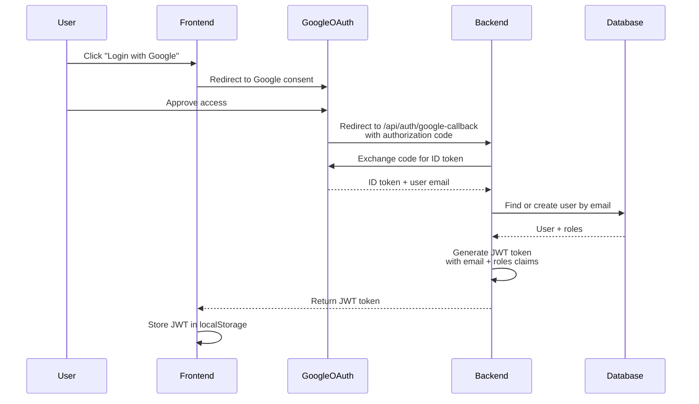
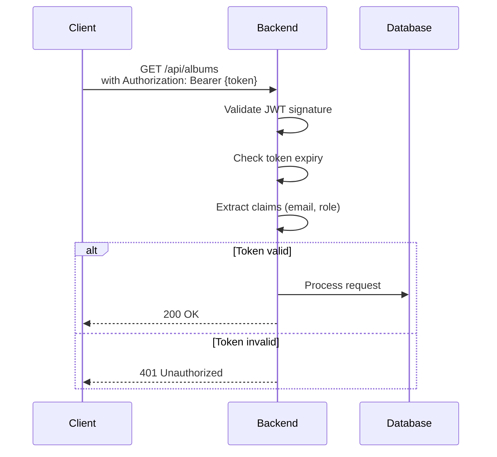

# Authentication

**📍 Navigation**
- 🏠 [Documentation Index](../INDEX.md)
- 🏗️ [Design Decisions](./DESIGN_DECISIONS.md) - All approved design decisions (D001: Authentication)
- 🏗️ [System Architecture](./SYSTEM_ARCHITECTURE.md) - Component overview
- 💾 [Database Schema](./DATABASE_SCHEMA.md) - Entity relationships
- 🔌 [API Design](./API_DESIGN.md) - REST endpoint patterns
- 📦 [Storage Layer](./STORAGE_LAYER.md) - File storage abstraction
- 📚 [All Guides](../Guides/) - TDD, Docker, CI/CD, Startup

---

# Authentication & Authorization

## Overview

PhotoGallery uses OAuth 2.0 with Google for authentication, combined with local role-based authorization using JWT tokens.

**See [DESIGN_DECISIONS.md](./DESIGN_DECISIONS.md) - D001: Microservice Authentication with Google OAuth + Local Database**

## Authentication Flow



## JWT Token Structure

```json
{
  "header": {
    "alg": "HS256",
    "typ": "JWT"
  },
  "payload": {
    "sub": "user@example.com",
    "email": "user@example.com",
    "role": ["Admin", "User"],
    "iat": 1234567890,
    "exp": 1234571490
  },
  "signature": "HMACSHA256(...)"
}
```

## Token Validation Flow



## Role-Based Access Control

### Roles

```
Admin:
  - Create/edit/delete albums
  - Upload photos
  - Generate access codes
  - View all user activity

User:
  - View own albums
  - View shared albums (via access code)
  - Download photos
```

### Authorization Example

```csharp
[ApiController]
[Route("api/albums")]
public class AlbumsController
{
    [Authorize]  // Any authenticated user
    [HttpGet]
    public async Task<IActionResult> GetAlbums()
    {
        // Returns only user's albums (filtered in service)
    }
    
    [Authorize(Roles = "Admin")]  // Admin only
    [HttpPost]
    public async Task<IActionResult> CreateAlbum(CreateAlbumRequest request)
    {
        // Creates album
    }
}
```

## API Endpoints

### Public (No Authentication)

| Method | Path | Description |
|--------|------|-------------|
| `POST` | `/api/auth/google-callback` | Handle Google OAuth redirect |

### Authenticated

| Method | Path | Description |
|--------|------|-------------|
| `GET` | `/api/auth/me` | Get current user info |
| `POST` | `/api/auth/logout` | Logout (frontend discards token) |
| `POST` | `/api/auth/refresh` | Refresh expiring token |

## Configuration

### Development (with DISABLE_AUTH)

```json
{
  "Authentication": {
    "DisableAuth": true
  }
}
```

Or via environment variable:
```bash
$env:DISABLE_AUTH = "true"
```

When disabled, backend creates a test user automatically:
```csharp
// Middleware creates test user
var testUser = new User
{
    Email = "testadmin@localhost",
    GoogleId = "test",
    Roles = new[] { "Admin", "User" }
};
```

### Development (with Google OAuth)

```json
{
  "Authentication": {
    "Google": {
      "ClientId": "...-app.googleusercontent.com",
      "ClientSecret": "...",
      "RedirectUri": "http://localhost:5105/api/auth/google-callback"
    }
  }
}
```

### Production (Google OAuth required)

```json
{
  "Authentication": {
    "Google": {
      "ClientId": "...-app.googleusercontent.com",
      "ClientSecret": "${GOOGLE_CLIENT_SECRET}",
      "RedirectUri": "https://api.photogallery.com/api/auth/google-callback"
    },
    "Jwt": {
      "Secret": "${JWT_SECRET}",
      "Issuer": "PhotoGallery",
      "Audience": "PhotoGalleryClient",
      "ExpiryMinutes": 60
    }
  }
}
```

## Frontend Integration

### Login

```typescript
// Angular component
export class LoginComponent {
  login() {
    // Redirect to Google OAuth
    window.location.href = `/api/auth/google-callback?...`;
  }
}
```

### Token Storage

```typescript
// In auth service
export class AuthService {
  login(token: string) {
    localStorage.setItem('jwt_token', token);
    this.currentUser = this.extractUserFromToken(token);
  }
  
  logout() {
    localStorage.removeItem('jwt_token');
  }
  
  getToken(): string | null {
    return localStorage.getItem('jwt_token');
  }
}
```

### API Calls with Token

```typescript
// In HTTP interceptor
export class AuthInterceptor implements HttpInterceptor {
  intercept(
    req: HttpRequest<any>,
    next: HttpHandler
  ): Observable<HttpEvent<any>> {
    const token = this.authService.getToken();
    if (token) {
      req = req.clone({
        setHeaders: {
          Authorization: `Bearer ${token}`
        }
      });
    }
    return next.handle(req);
  }
}
```

## Testing Authentication

```csharp
[Fact]
public async Task GetAlbums_WithValidToken_Returns200()
{
    // Arrange
    var user = new User { Email = "test@example.com", Roles = new[] { "Admin" } };
    var token = jwtTokenService.GenerateToken(user);
    
    client.DefaultRequestHeaders.Authorization = 
        new AuthenticationHeaderValue("Bearer", token);
    
    // Act
    var response = await client.GetAsync("/api/albums");
    
    // Assert
    Assert.Equal(HttpStatusCode.OK, response.StatusCode);
}

[Fact]
public async Task GetAlbums_WithoutToken_Returns401()
{
    // Act
    var response = await client.GetAsync("/api/albums");
    
    // Assert
    Assert.Equal(HttpStatusCode.Unauthorized, response.StatusCode);
}

[Fact]
public async Task CreateAlbum_WithUserRole_Returns403()
{
    // Arrange
    var user = new User { Email = "test@example.com", Roles = new[] { "User" } };
    var token = jwtTokenService.GenerateToken(user);
    
    client.DefaultRequestHeaders.Authorization = 
        new AuthenticationHeaderValue("Bearer", token);
    
    // Act
    var response = await client.PostAsync("/api/albums", ...);
    
    // Assert
    Assert.Equal(HttpStatusCode.Forbidden, response.StatusCode);
}
```

## Future Extensions

### Additional OAuth Providers

To add Facebook, Microsoft, etc., create additional auth providers:

```csharp
public interface IExternalAuthProvider
{
    Task<ExternalAuthResult> AuthenticateAsync(string code);
}

// Add implementations
public class FacebookAuthProvider : IExternalAuthProvider { ... }
public class MicrosoftAuthProvider : IExternalAuthProvider { ... }

// Route to correct provider
var provider = providerType switch
{
    "google" => new GoogleAuthProvider(...),
    "facebook" => new FacebookAuthProvider(...),
    "microsoft" => new MicrosoftAuthProvider(...),
};
```

### API Key Authentication

For future service-to-service communication:

```csharp
public interface IApiKeyValidator
{
    Task<bool> ValidateAsync(string apiKey);
}

// Usage in middleware or custom authorization handler
```

---

## Related Documentation

- 🏗️ [Design Decisions](./DESIGN_DECISIONS.md) - D001 explains auth design
- 🏗️ [System Architecture](./SYSTEM_ARCHITECTURE.md) - Auth flow diagram
- 🔌 [API Design](./API_DESIGN.md) - Protected endpoints
- 📚 [Guides](../Guides/) - Setup and configuration

---

**Last Updated**: 2026-05-03  
**Current Providers**: Google OAuth  
**Status**: Production ready  
**Related Decision**: [D001](./DESIGN_DECISIONS.md)
