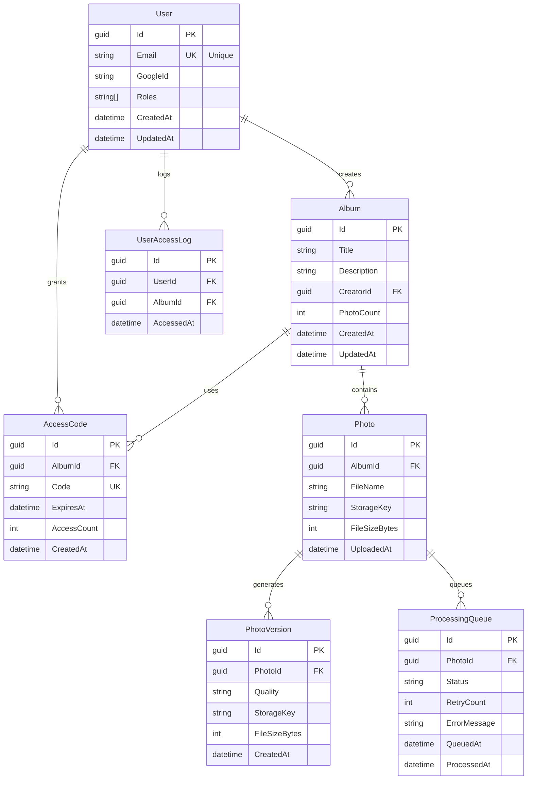

# Database Schema

**📍 Navigation**
- 🏠 [Documentation Index](../INDEX.md)
- 🏗️ [Design Decisions](./DESIGN_DECISIONS.md) - All approved design decisions
- 🏗️ [System Architecture](./SYSTEM_ARCHITECTURE.md) - Component overview
- 🔌 [API Design](./API_DESIGN.md) - REST endpoint patterns
- 📦 [Storage Layer](./STORAGE_LAYER.md) - File storage abstraction
- 🔐 [Authentication](./AUTHENTICATION.md) - OAuth and JWT patterns
- 📚 [All Guides](../Guides/) - TDD, Docker, CI/CD, Startup

---

# PhotoGallery Database Schema

## Entity Relationship Diagram

## Detailed Entity Definitions

See [DESIGN_DECISIONS.md](./DESIGN_DECISIONS.md) for context on how data is structured.

---

**Last Updated**: 2026-05-03  
**Status**: Reference document (see System Architecture for full details)  
**Related**: [Design Decisions](./DESIGN_DECISIONS.md) • [API Design](./API_DESIGN.md)
