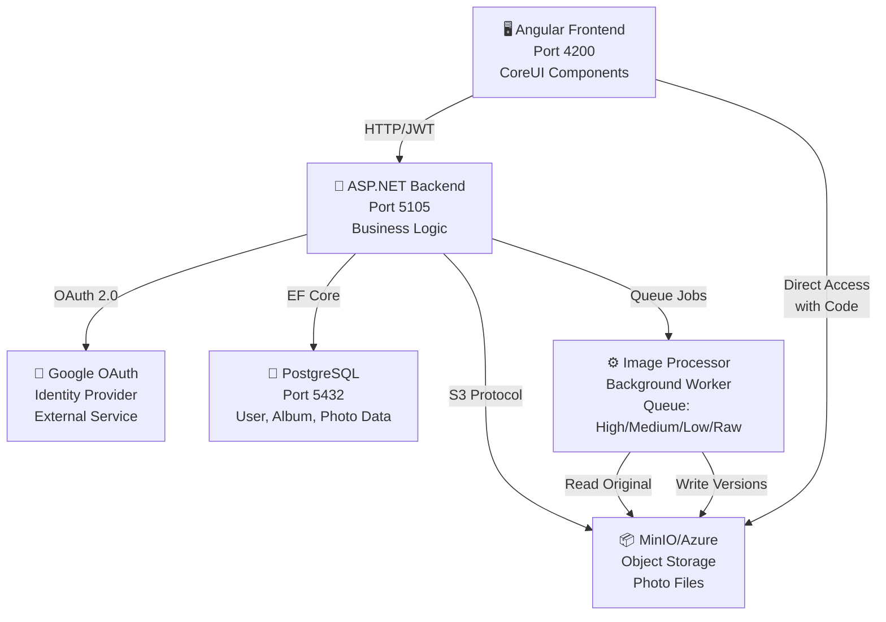
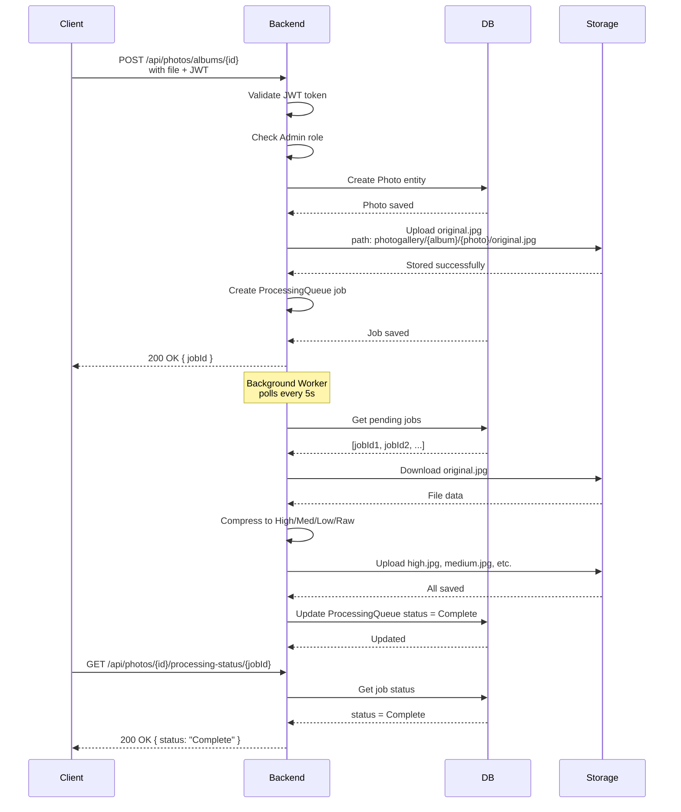
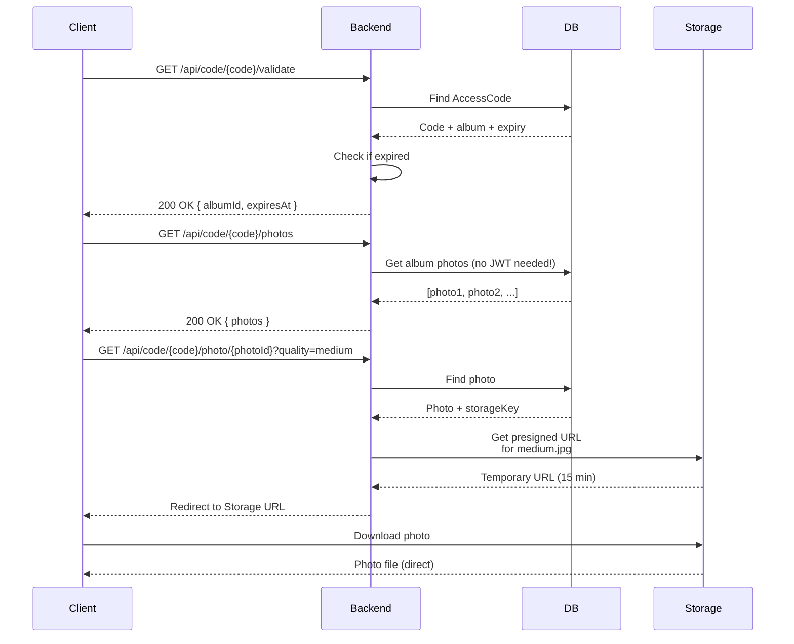

# System Architecture

**📍 Navigation**
- 🏠 [Documentation Index](../INDEX.md)
- 🏗️ [Design Decisions](./DESIGN_DECISIONS.md) - All approved design decisions
- 💾 [Database Schema](./DATABASE_SCHEMA.md) - Entity relationships
- 🔌 [API Design](./API_DESIGN.md) - REST endpoint patterns
- 📦 [Storage Layer](./STORAGE_LAYER.md) - File storage abstraction
- 🔐 [Authentication](./AUTHENTICATION.md) - OAuth and JWT patterns
- 📚 [All Guides](../Guides/) - TDD, Docker, CI/CD, Startup

---

# PhotoGallery System Architecture

## High-Level Component Diagram



## Key Components

### 1. **Frontend (Angular + CoreUI)**
- **Port**: 4200 (development)
- **Framework**: Angular with CoreUI components
- **Auth**: JWT Bearer token in Authorization header
- **Features**:
  - User authentication (Google OAuth redirect)
  - Album management (create, edit, delete, view)
  - Photo upload with drag-and-drop
  - Access code management with date picker
  - Photo download by quality level
  - Real-time processing status

**Links**: 🔗 [API Design](./API_DESIGN.md) • [Authentication](./AUTHENTICATION.md)

### 2. **Backend (ASP.NET 9.0)**
- **Port**: 5105 (development)
- **Framework**: ASP.NET Core 9.0
- **Language**: C#
- **Architecture**: Clean Architecture (Domain/Infrastructure/Presentation)
- **Features**:
  - RESTful API endpoints
  - JWT token generation and validation
  - Google OAuth integration
  - Role-based access control (Admin/User)
  - Storage abstraction (MinIO/Azure)
  - Image processing queue
  - Database migrations (EF Core code-first)

**Layers**:
- **Domain**: Entities (User, Album, Photo, PhotoVersion, AccessCode, ProcessingQueue)
- **Infrastructure**: Repositories, Storage providers, Auth services
- **Presentation**: API Controllers, Middleware

**Links**: 🔗 [Design Decisions](./DESIGN_DECISIONS.md) • [Database Schema](./DATABASE_SCHEMA.md) • [API Design](./API_DESIGN.md) • [Storage Layer](./STORAGE_LAYER.md)

### 3. **Database (PostgreSQL)**
- **Port**: 5432
- **Container**: Docker (photogallery-postgres-1)
- **Entities**: User, Album, Photo, PhotoVersion, AccessCode, ProcessingQueue, UserAccessLog
- **Migrations**: Code-first EF Core
- **Persistence**: Docker volume (photogallery_postgres_data)

**Links**: 🔗 [Database Schema](./DATABASE_SCHEMA.md) • [Design Decisions](./DESIGN_DECISIONS.md)

### 4. **Object Storage (MinIO/Azure)**
- **Development**: MinIO (Port 9000, Port 9001 console)
- **Production**: Azure Blob Storage
- **Protocol**: S3-compatible API
- **Container**: Docker (photogallery-minio-1)
- **Persistence**: Docker volume (photogallery_minio_data)
- **Path Structure**: `photogallery/{album_guid}/{photo_guid}/{quality}.jpg`

**Links**: 🔗 [Storage Layer](./STORAGE_LAYER.md) • [Design Decisions](./DESIGN_DECISIONS.md)

### 5. **Image Processing Worker**
- **Location**: Background thread in Backend service
- **Trigger**: Photos added to ProcessingQueue
- **Frequency**: Polls every 5 seconds
- **Output**: 4 quality versions (High, Medium, Low, Raw)
- **Storage**: Saves to MinIO/Azure via IStorageProvider
- **Status**: Tracks Pending → Processing → Complete → Error

**Links**: 🔗 [Design Decisions](./DESIGN_DECISIONS.md) • [Storage Layer](./STORAGE_LAYER.md)

### 6. **Authentication Flow**
1. User clicks "Login with Google"
2. Redirected to Google OAuth consent screen
3. After approval, redirected to `/api/auth/google-callback`
4. Backend validates token with Google
5. If new user, creates user in database with extracted email + claims
6. Generates JWT token with claims (email, role)
7. Returns JWT to frontend
8. Frontend stores JWT in localStorage
9. All subsequent requests include `Authorization: Bearer {jwt}`

**Links**: 🔗 [Authentication](./AUTHENTICATION.md) • [Design Decisions](./DESIGN_DECISIONS.md)

---

## Data Flow Diagrams

### Photo Upload Flow



### Access Code Download Flow



---

## Technology Stack

### Backend
| Layer | Technology | Purpose |
|-------|-----------|---------|
| **Runtime** | .NET 9.0 | ASP.NET Core framework |
| **Language** | C# | Backend logic |
| **Database** | Entity Framework Core 9.0 | ORM, migrations |
| **Database** | PostgreSQL 17 | Relational data store |
| **Storage** | AWSSDK.S3, Azure.Storage.Blobs | S3/Azure SDKs |
| **Images** | SixLabors.ImageSharp 3.1.12 | Image processing |
| **Auth** | System.IdentityModel.Tokens.Jwt | JWT handling |
| **Testing** | xUnit, Moq | Unit testing framework |

### Frontend
| Layer | Technology | Purpose |
|-------|-----------|---------|
| **Framework** | Angular 18 | UI framework |
| **UI Library** | CoreUI Angular Pro | Component library |
| **Icons** | CoreUI Icons Pro | Icon library |
| **HTTP** | HttpClient | API calls |
| **Storage** | localStorage | JWT token storage |

### Infrastructure
| Component | Technology | Version |
|-----------|-----------|---------|
| **Containers** | Docker | Latest |
| **Orchestration** | Docker Compose | Latest |
| **Database** | PostgreSQL | 17 |
| **Object Store** | MinIO | Latest |
| **Port Forwarding** | PortProxy (Windows) | Built-in |

---

## Design Patterns

### 1. **Interface-Based Abstraction**
Storage providers abstract behind `IStorageProvider`:
- `MinioStorageProvider` for development
- `AzureStorageProvider` for production
- Future: `S3StorageProvider`, `GoogleCloudStorageProvider`

**Benefit**: Easy provider switching, testable with Moq

### 2. **Dependency Injection**
All services injected via constructor:
```csharp
public class PhotosController
{
    private readonly IPhotoRepository photoRepository;
    private readonly IStorageProvider storageProvider;
    
    public PhotosController(
        IPhotoRepository photoRepository,
        IStorageProvider storageProvider)
    {
        this.photoRepository = photoRepository;
        this.storageProvider = storageProvider;
    }
}
```

### 3. **Repository Pattern**
Generic `IRepository<T>` for database access:
- `IAlbumRepository` - Album-specific queries
- `IPhotoRepository` - Photo-specific queries
- `IAccessCodeRepository` - AccessCode-specific queries

### 4. **Factory Pattern**
`StorageProviderFactory` selects provider based on configuration:
```csharp
var provider = StorageProviderFactory.Create(
    Environment.GetEnvironmentVariable("STORAGE_PROVIDER") ?? "minio"
);
```

### 5. **Background Worker Pattern**
`ImageProcessingService` background thread polls queue:
- Runs every 5 seconds
- Gets pending jobs from ProcessingQueue
- Processes images in isolation
- Updates status in database

### 6. **Specification Pattern** (for future use)
Query specifications encapsulate filtering logic:
```csharp
var activeAlbums = await albumRepository.FindAsync(new ActiveAlbumsSpecification());
```

---

## File Organization

```
PhotoGallery/
├── Domain/
│   ├── Entities/                  # Album, Photo, AccessCode, etc.
│   └── Events/                    # Domain events
├── Infrastructure/
│   ├── Data/
│   │   ├── Configurations/        # EF entity configurations
│   │   └── Migrations/            # EF migrations
│   ├── Services/
│   │   ├── Storage/               # IStorageProvider implementations
│   │   ├── Processing/            # Image processing service
│   │   └── Auth/                  # External auth services
│   ├── Repositories/              # IRepository implementations
│   └── External/                  # External service integrations
├── Presentation/
│   ├── Controllers/               # API endpoints
│   ├── Middleware/                # Auth, error handling
│   ├── DTOs/                      # Request/response models
│   └── Extensions/                # Dependency injection
├── Program.cs                     # Application entry point
└── appsettings.json               # Configuration

PhotoGallery.Tests/
├── UnitTests/                     # Unit tests by feature
├── IntegrationTests/              # Integration tests (future)
└── E2ETests/                      # End-to-end tests (future)

Documentation/
├── Architecture/                  # Design decisions, diagrams
├── Phase-Reports/                 # Completed phases
├── Guides/                        # How-to guides, TDD, Docker
└── Startup/                       # Deployment documentation
```

---

## Environment Configuration

### Development
- Frontend: http://localhost:4200
- Backend: http://localhost:5105
- Database: localhost:5432
- Storage: http://localhost:9000 (MinIO)
- Console: http://localhost:9001 (MinIO UI)
- Auth: Keycloak or DISABLE_AUTH=true

### Production
- Frontend: https://photogallery.example.com
- Backend: https://api.photogallery.example.com
- Database: Azure Database for PostgreSQL
- Storage: Azure Blob Storage
- Auth: Google OAuth (credentials required)

---

## Performance Considerations

### Image Processing
- Asynchronous: Upload returns immediately
- Background worker: Doesn't block API requests
- Compression: 4 quality levels reduce storage/bandwidth
- Versioning: Users choose quality at download time

### Caching
- JWT tokens: Cached in browser localStorage
- Database queries: Indexed on common filters
- Storage access: S3/Azure caching enabled

### Scalability
- Stateless API: Can run multiple backends
- Database: Vertically scalable (PostgreSQL)
- Storage: Horizontally scalable (MinIO/Azure)
- Processing: Can add more worker threads

---

## Security

### Authentication
- OAuth 2.0 with Google (external authentication)
- JWT tokens (stateless, can't be revoked mid-request)
- HTTPS required in production

### Authorization
- Role-based access control (Admin/User)
- Access codes for public album sharing
- Code expiration for time-limited access

### Storage
- Private buckets (no public access without code)
- Path-based access control (album owner can see all photos)
- Presigned URLs for temporary public access

---

## Monitoring & Logging

### Logs
- Backend logs: Console + file output
- Database logs: Query tracking
- Storage logs: S3/Azure access logs

### Metrics (Future)
- Request latency
- Image processing time
- Storage usage
- Cache hit rates

---

## Related Documentation

- 🏠 [Documentation Index](../INDEX.md) - Navigation hub
- 🏗️ [Design Decisions](./DESIGN_DECISIONS.md) - Why decisions were made
- 💾 [Database Schema](./DATABASE_SCHEMA.md) - Entity relationships
- 🔌 [API Design](./API_DESIGN.md) - Endpoint specifications
- 📦 [Storage Layer](./STORAGE_LAYER.md) - Storage implementation
- 🔐 [Authentication](./AUTHENTICATION.md) - Auth patterns

---

**Last Updated**: 2026-05-03  
**Architecture Version**: 1.0  
**All Components Documented**: ✅ Yes
