# 01 — High-Level Architecture

One Mermaid component diagram of the whole system. Use this to orient before drilling into a specific surface.

## Diagram

```mermaid
flowchart TB
  subgraph Browsers["Clients"]
    SPA["Angular SPA<br/>(authenticated user)"]
    Visitor["Code-gallery visitor<br/>(unauthenticated, access code)"]
  end

  subgraph Azure["Azure (Trial / Prod) — same shape locally via Docker"]

    subgraph API_App["API Container App (min=max=1 replica)"]
      Controllers["ASP.NET Controllers<br/>+ SignalR Hub<br/>+ JWT auth"]
      Scheduler["AdminJobScheduler<br/>(BackgroundService)"]
    end

    subgraph Worker_App["Worker Container App (KEDA-scaled N replicas)"]
      ProcWorker["PhotoProcessingWorker"]
      ConsWorker["StorageConsistencyWorker"]
      ReapWorker["OrphanedBlobReaperWorker"]
      UrlWorker["PhotoVersionUrlRefreshWorker"]
      Dispatcher["AdminJobDispatcher<br/>(claim + route)"]
    end

    subgraph DB["SQL Server (Azure SQL in prod, Docker MSSQL locally)"]
      Photos[("Photos<br/>Albums<br/>ProcessingQueueItems")]
      AdminJobs[("AdminJobs")]
      Heartbeats[("WorkerHeartbeats")]
      Settings[("RuntimeSettings")]
    end

    subgraph Storage["Object Storage (Azure Blob in prod, MinIO locally)"]
      Blobs[("photogallery/<br/>{albumId}/<br/>{photoId}/<br/>{quality}.jpg")]
    end

    KV["Key Vault<br/>(secrets, conn strings)"]
  end

  SPA -- HTTPS --> Controllers
  Visitor -- HTTPS --> Controllers
  SPA -. SignalR/WebSocket .-> Controllers

  Controllers -- EF Core --> Photos
  Controllers -- EF Core --> AdminJobs
  Controllers -- EF Core --> Heartbeats
  Controllers -- EF Core --> Settings
  Controllers -- IStorageProvider --> Blobs

  Scheduler -. enqueue routine jobs .-> AdminJobs

  Dispatcher -- claim --> AdminJobs
  ProcWorker -- lease items --> Photos
  ProcWorker -- read/write --> Blobs
  ConsWorker -- reconcile --> Photos
  ConsWorker -- list/check --> Blobs
  ReapWorker -- list/delete --> Blobs
  ReapWorker -- read --> Photos
  UrlWorker -- refresh --> Photos
  UrlWorker -- mint SAS --> Blobs

  ProcWorker -- stamp --> Heartbeats
  ConsWorker -- stamp --> Heartbeats
  ReapWorker -- stamp --> Heartbeats
  UrlWorker -- stamp --> Heartbeats

  Controllers -- read --> Settings
  ProcWorker -- read --> Settings
  ConsWorker -- read --> Settings
  ReapWorker -- read --> Settings
  UrlWorker -- read --> Settings
  Scheduler -- read --> Settings

  Controllers -. DefaultAzureCredential .-> KV
  Worker_App -. DefaultAzureCredential .-> KV

  SPA -. direct PUT via SAS URL .-> Blobs
  SPA -. direct GET via SAS URL .-> Blobs
  Visitor -. direct GET via short-lived SAS .-> Blobs
```

## How to read this

* The API and the worker apps are two separate Container Apps running the same image. The split is controlled by the `WorkersEnabled` env var.
* Everything labelled "stamp" is a `WorkerHeartbeatWriter.StampAsync` call. See [../Architecture/05-Worker-Heartbeats.md](../Architecture/05-Worker-Heartbeats.md).
* The dotted arrows from SPA / Visitor to Blobs represent the direct-to-blob fast path. Bytes do not traverse the API host.
* The DB sits between the two app processes as both the persistent store and the coordination layer. No separate message broker exists.
* Key Vault is reached via `DefaultAzureCredential`. Locally that resolves to `az login` credentials.

## What is intentionally absent

* No Service Bus or Storage Queue. The `AdminJobs` table is the queue. See [../Architecture/02-AdminJob-Queue.md](../Architecture/02-AdminJob-Queue.md).
* No Redis. Pre-signed URL caching is in-process per replica.
* No separate identity service. JWT issuance is in the `Authentication` library project.

## When to update this diagram

* A new background worker is added or removed.
* A new dependency on an external Azure service appears.
* A topology change (e.g. introducing a real broker or a Redis cache).
* A new client type appears.

Anything below the API/worker level (queries, internal flow) belongs in a different diagram (sequence or DFD). Keep this one strictly at the component level.
