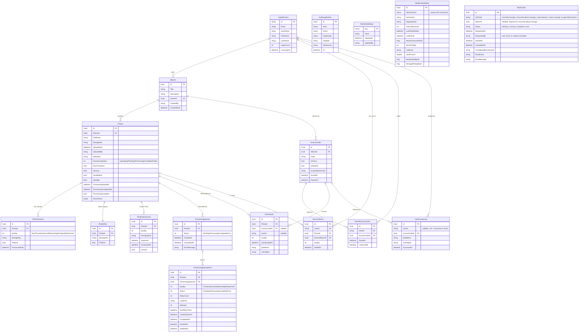

# 02 — Database Schema

Entity-relationship diagram of the PhotoGalleryDev database. Generated by inspecting `PhotoGallery/Data/ApplicationDbContext.cs`. Regenerate alongside any migration that adds or changes a table.

## Diagram

## Notes on the relationships

* **`PhotoVersions` vs `PhotoFiles`**: both are write-only today. They were intended to track derived variants and originals separately. Neither is read by any current code path. They are still on the schema so the cascade-delete chain in `FailedPhotoPurgeService` has somewhere to point. See `MEMORY.md` for the rationale.
* **`ProcessingQueueItems.LeaseExpiresAt`**: the lease mechanism. A NULL or expired value plus `Status = Processing` is an orphan. The reconciler resets it to `Pending`.
* **`AdminJobs` unique key**: there is no unique constraint on `(JobType, AlbumId)`. Deduplication is enforced at the controller layer in `EnqueueAdminJobAsync`. If a future requirement needs hard uniqueness, add an index.
* **`WorkerHeartbeats` unique key**: `(WorkerName, InstanceId)`. Enforced by `WorkerHeartbeatConfiguration`.
* **`AccessCodes.IsDeleted`**: soft delete. Cascade-deleting an album hard-deletes its codes. The soft flag exists for admin "undo" within an album.
* **`UserAccessLog.UserId` nullable**: null means anonymous visitor used an access code. Authenticated visits set the user id.

## Generation

This diagram is hand-maintained today. The `er-diagram-from-efcore` skill describes the path to auto-regenerating it from `dotnet ef dbcontext optimize` output, owned by the dba-efcore agent. Treat the auto-regenerated version as canonical when that lands.

## When to update

* Any migration that adds, removes, or renames a table.
* Any migration that adds, removes, or changes a foreign key.
* Any change to a column type that the diagram surfaces (string → enum, int → long, nullability flip).
* Pure additive non-FK columns can be left out of the diagram if they don't affect cardinality, but prefer adding them.
