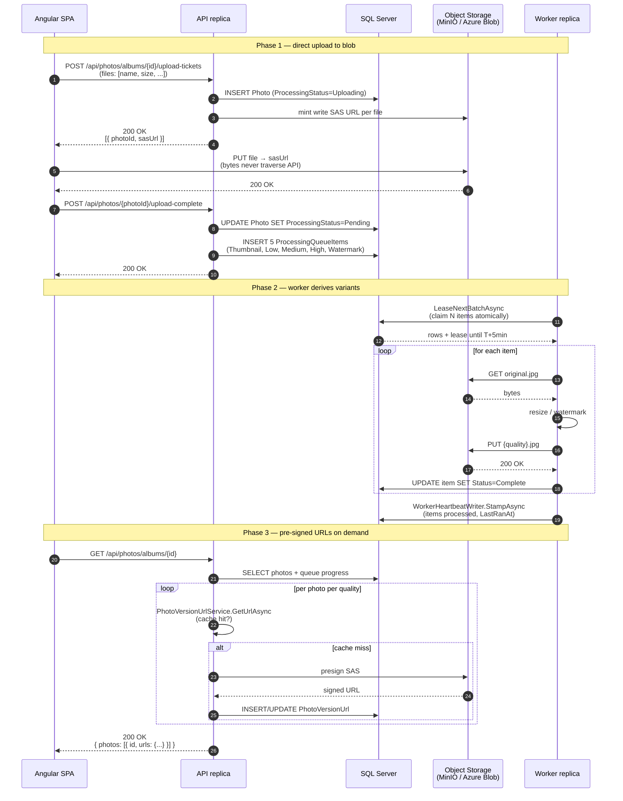

# 03 — Photo Upload Sequence

End-to-end sequence for the happy path of one photo upload. Reference for [../Architecture/01-Processing-Pipeline.md](../Architecture/01-Processing-Pipeline.md).

## Diagram

## Key points

* The API row insert and the SAS minting happen before the file leaves the SPA. The `Photo.ProcessingStatus = Uploading` row is the breadcrumb that `StorageConsistencyService` uses if the SPA dies after the PUT but before `upload-complete`.
* The Watermark queue item is enqueued in step 8 along with the four base qualities. It is the same shape as the others, but the worker handler produces two blobs (`thumbnail-watermarked.jpg` + `medium-watermarked.jpg`) in one run.
* The lease step uses an atomic `UPDATE-FROM-CTE` on SQL Server. Two workers cannot pick the same row. See `ProcessingQueueItemRepository.LeaseNextBatchAsync`.
* The URL cache (step "cache hit?") is per-process. Each API replica maintains its own. Cache TTL is bounded under the SAS expiry by `BlobStorage:UrlCacheSlidingMinutes` (default 30) capped at `BlobStorage:PublicUrlTtlMinutes` (default 60) minus a 3-minute safety margin.

## Failure modes covered by the recovery doc

* SPA dies between PUT and upload-complete.
* Worker dies mid-tick.
* Lease expires before the item completes.
* Original blob is missing when the worker tries to read it (chaos or manual).

See [../Architecture/01-Processing-Pipeline.md#failure-modes-and-how-the-pipeline-recovers](../Architecture/01-Processing-Pipeline.md#failure-modes-and-how-the-pipeline-recovers) for the full table.

## When to update

* Any change to the upload protocol (upload-tickets, upload-complete).
* Any change to the queue-item lifecycle that affects the worker loop.
* Any change to the pre-signed URL minting strategy.
