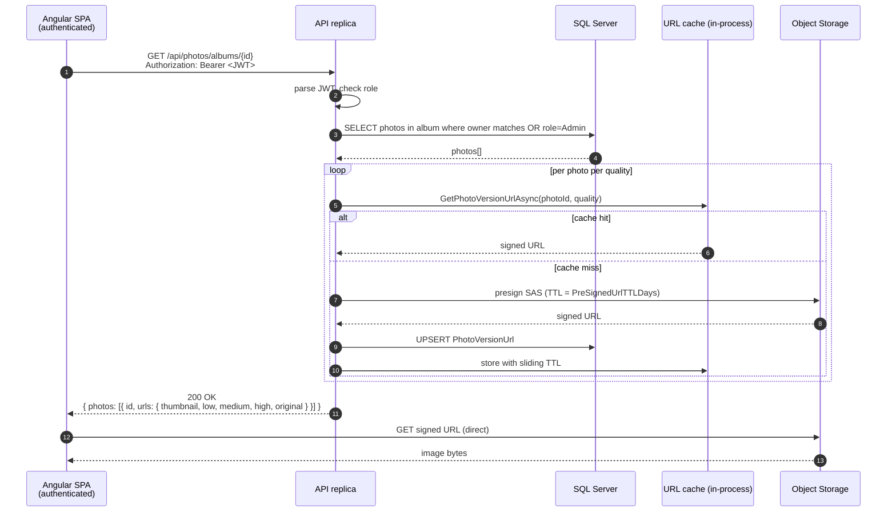
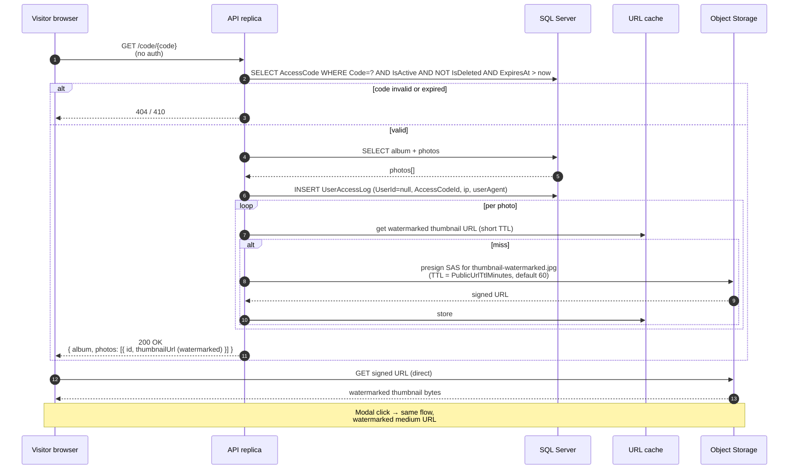
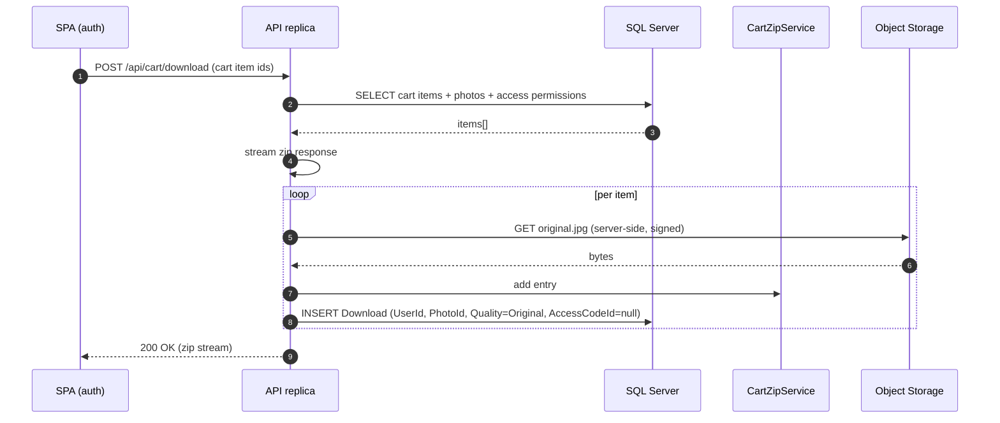

# 04 — Photo Download Sequence

End-to-end sequence for both download paths: authenticated user from their own album, and unauthenticated visitor through an access code.

## Authenticated user (own album)

## Access-code visitor (anonymous)

## Download to disk (cart checkout)

## Key points

* The SPA never proxies image bytes through the API for thumbnail / preview rendering. It receives signed URLs and pulls bytes directly from storage.
* Cart download is the one exception. The zip is streamed server-side because we need to assemble multiple originals into one response and the storage backend does not zip natively.
* Watermarked variants only exist for thumbnail and medium. The public code-gallery never has access to the unwatermarked versions or to high/original.
* Every visitor request appends a row to `UserAccessLog`. The admin Visitors tab groups by IP + User-Agent to surface unique visitors.

## URL TTL summary

| Audience              | URL pattern                       | TTL                                                | Refresh strategy                                              |
| --------------------- | --------------------------------- | -------------------------------------------------- | ------------------------------------------------------------- |
| Authenticated user    | `original`, `low`, `medium`, `high` | `BlobStorage:PreSignedUrlTTLDays` (default 7 days) | `PhotoVersionUrlRefreshWorker` rotates inside the refresh window. |
| Access-code visitor   | `thumbnail-watermarked`, `medium-watermarked` | `BlobStorage:PublicUrlTtlMinutes` (default 60 min) | Per-request mint, in-process cache, no DB persistence.        |
| Cart originals        | server-side GET only              | none (server reads bytes)                          | n/a                                                           |

## When to update

* Any change to the URL cache TTL or refresh strategy.
* Any change to the access-code authorization model.
* Any new download endpoint that bypasses the existing paths.
