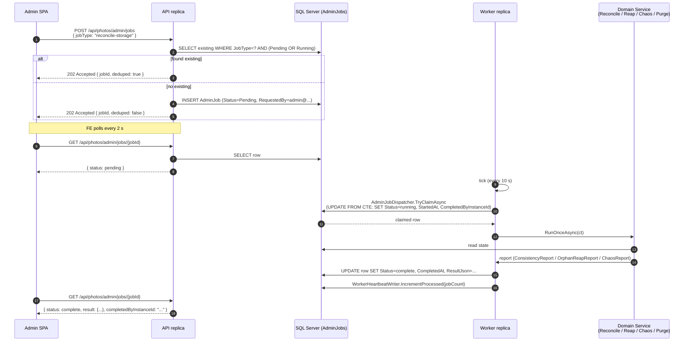
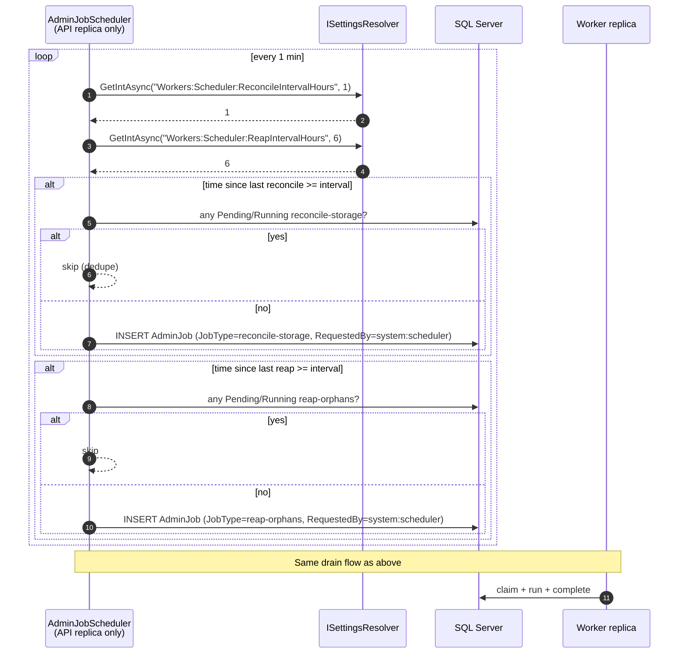
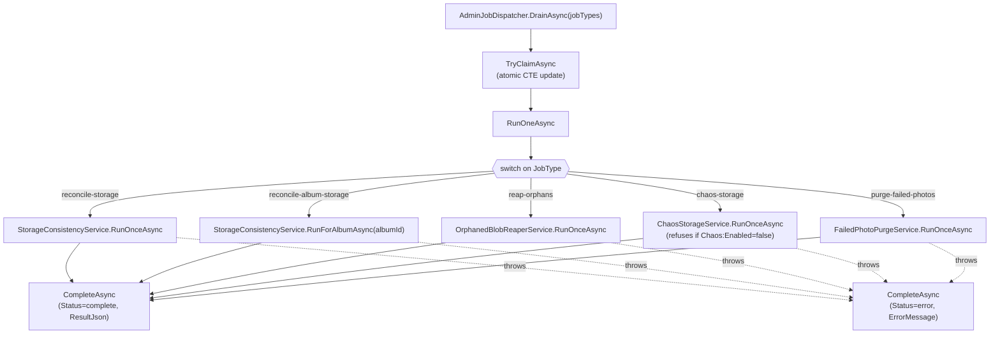

# 05 — Admin Job Flow Sequence

How an admin click becomes worker work. Two flows: admin-triggered, and scheduler-triggered. Both end in the same `AdminJobDispatcher.DrainAsync` call.

## Admin-triggered (manual)

## Scheduler-triggered (routine maintenance)

## Job-type routing inside the dispatcher

## Key points

* The atomic claim is the only piece that needs to be exactly-once. Everything else is at-least-once with idempotent enqueue.
* Workers bound their drain at 5 jobs per tick so one runaway admin click cannot burn the whole tick.
* `StorageConsistencyWorker` drains five job types (`reconcile-storage`, `reconcile-album-storage`, `chaos-storage`, `purge-failed-photos`). `OrphanedBlobReaperWorker` drains one (`reap-orphans`). Routing is by the `jobTypes[]` argument to `DrainAsync`.
* The scheduler does not need a distributed lock. Idempotent enqueue means even if it ran on every replica the queue would still only get one row per cycle.

## When to update

* New `AdminJobType` constant. Update the dispatcher routing diagram.
* Change to the claim strategy (e.g. moving to a real broker).
* Change to scheduler cadence policy (e.g. adding a new routine job).
