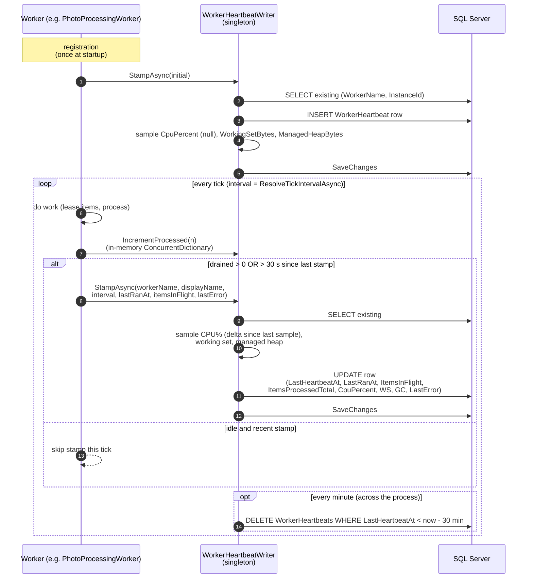
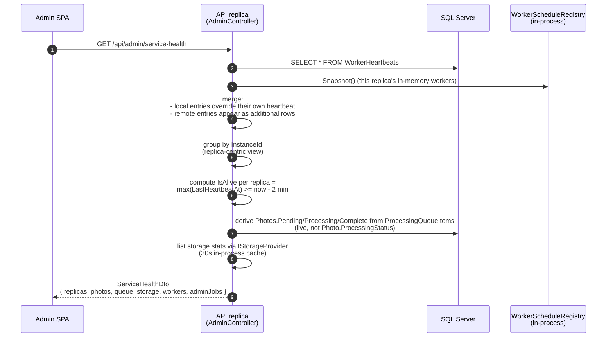
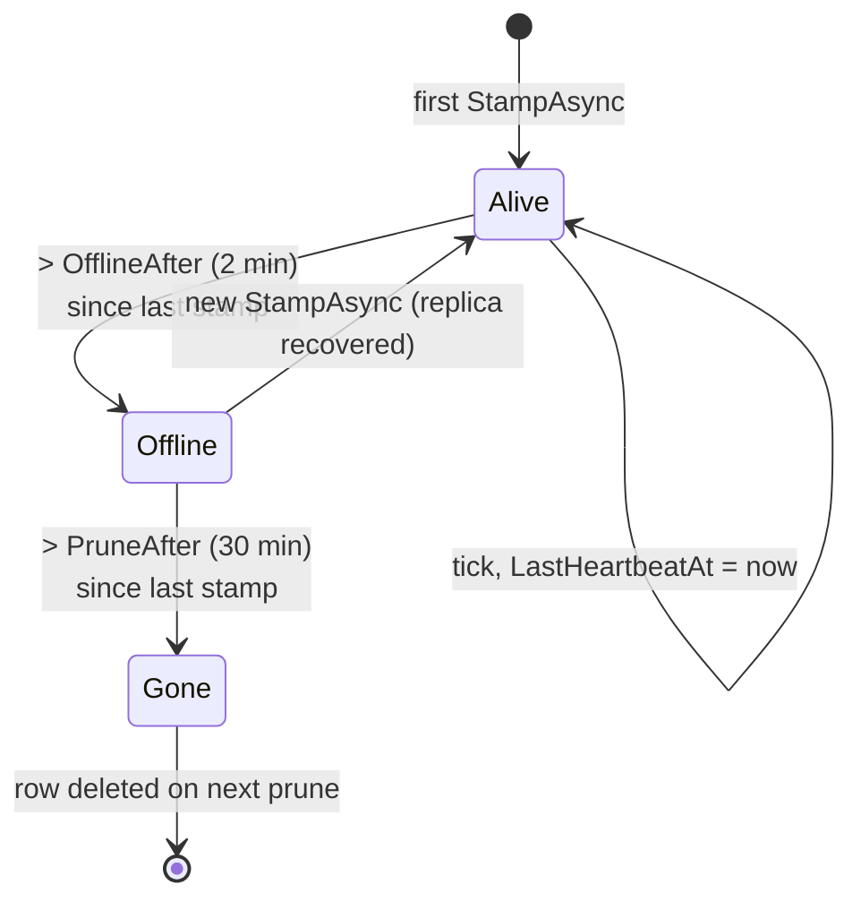

# 06 — Worker Heartbeat Sequence

How a worker reports liveness, how the API replica reads it, how the dashboard renders the result.

## Write path (per worker tick)

## Read path (Service Health page)

## Liveness state machine

## Notes

* `CpuPercent` is null on the very first heartbeat because two samples of `TotalProcessorTime` are required for a delta.
* The prune lock (`_lastPruneAt`) is process-level, not DB-level. Two replicas pruning at the same time race harmlessly: both will see the same set of stale rows, the SQL `DELETE` is idempotent.
* `WorkerScheduleRegistry` is per-process. It is the canonical "what is registered" view inside one replica. The DB heartbeat table is the canonical "what is registered across all replicas" view.
* The Service Health page merge step prefers the in-process registry data for the local replica (real-time, no DB read latency) and falls back to the DB heartbeat for all remote replicas.

## When to update

* Change to the prune cadence or retention.
* Change to the alive/offline thresholds (`WorkerHeartbeatThresholds`).
* New capacity metric added to the heartbeat row.
* Change to the heartbeat throttling rule.
