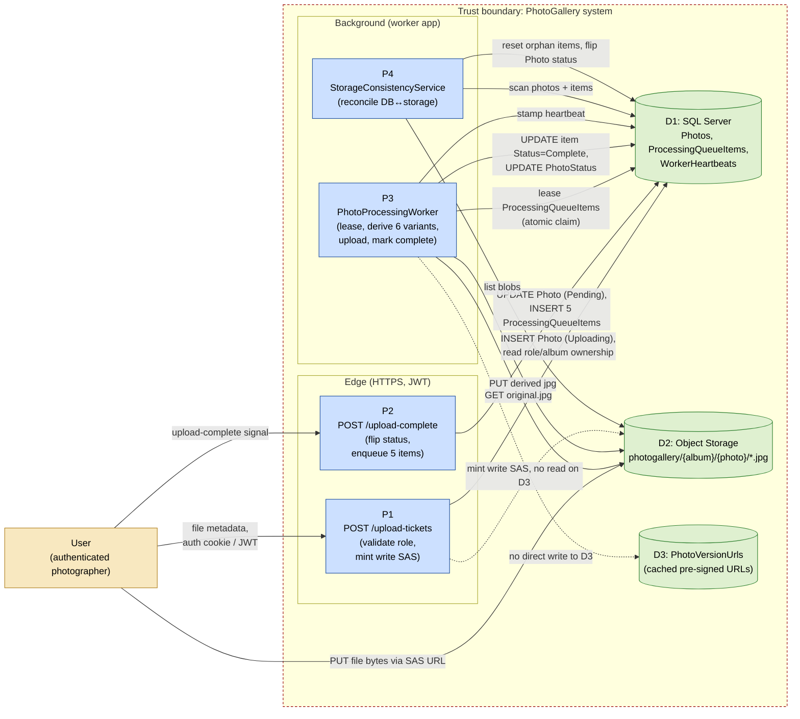

# 07 — Photo Upload Data Flow Diagram

Level-1 data flow diagram for the photo upload use case. Identifies the entities, the processes, the data stores, and the trust boundaries.

This is the diagram pattern owned by the security-reviewer agent. Use it as a starting point for threat-modeling new endpoints. See the `data-flow-diagram-security` skill for the canonical format.

## DFD

## Data elements

| Label | Element                                                          | Sensitivity                                                            |
| ----- | ---------------------------------------------------------------- | ---------------------------------------------------------------------- |
| `User` | Authenticated photographer (Admin or AlbumCreator role)         | Identity bound by JWT. Roles enforced server-side.                     |
| P1    | `PhotosController.RequestUploadTickets`                          | Issues write-only single-blob SAS. TTL bounded.                        |
| P2    | `PhotosController.UploadComplete`                                | Idempotent on `photoId`. Cannot promote photos owned by other users.   |
| P3    | `PhotoProcessingWorker` + `ImageProcessingService`               | No public ingress. Reads/writes via `IStorageProvider`.                |
| P4    | `StorageConsistencyService.RunOnceAsync` / `RunForAlbumAsync`    | Triggered by `AdminJobScheduler` and admin enqueue.                    |
| D1    | SQL Server (Azure SQL prod, Docker MSSQL local)                  | Workload Identity in Azure. Connection string in Key Vault.            |
| D2    | Object Storage (Azure Blob prod, MinIO local)                    | User-delegation SAS only in prod. Shared keys disabled.                |
| D3    | `PhotoVersionUrls` table (cached URLs)                           | Pre-signed URLs are bearer tokens. Bounded TTL.                        |

## Trust boundaries crossed

1. User → P1: TLS + JWT bearer. Role checked against `Authentication/AuthorizationPolicies`.
2. User → D2 (direct PUT via SAS): TLS + SAS bearer. SAS scope is write+create on a single blob, expires in `UploadTicketTtl`.
3. P3 → D2: Worker uses `DefaultAzureCredential` for Azure Blob (Workload Identity) or access key for MinIO.
4. P3 → D1: EF Core via connection string from Key Vault.

## Threats and mitigations

| Threat                                                       | Mitigation                                                                                       |
| ------------------------------------------------------------ | ------------------------------------------------------------------------------------------------ |
| User uploads a non-image, gigantic file                       | SAS is single-blob, single-content-type scoped. Server-side size validation on `upload-complete`. Worker rejects on first decode.                                                                          |
| User uploads to another album they don't own                  | P1 checks `Album.OwnerId == user.Id OR user has Admin role` before minting SAS.                  |
| Replay of a captured SAS URL                                   | SAS expires in `UploadTicketTtl` (short). Subsequent attempts to re-use the same `photoId` get an `alreadyComplete` short-circuit response.                                                                  |
| Worker steals another worker's lease                          | Atomic CTE-based claim. The `LeaseExpiresAt` column is the lock.                                  |
| Storage drift (chaos, manual delete, partial restore)          | `StorageConsistencyService` reconciles. Missing original → Photo flipped to Failed after grace.   |
| Pre-signed URL leak                                           | Bounded TTL. Public visitor URLs use the short TTL path. Watermarked-only for code-gallery.       |
| Photo metadata injection                                       | `Metadata` column is opaque JSON. Never executed. Sanitized on read by the SPA when displayed.    |

## When to update

* New endpoint added to the upload flow.
* New data store written to during upload.
* New trust-boundary crossing introduced.
* Change to the SAS minting strategy (scope, TTL, auth model).
