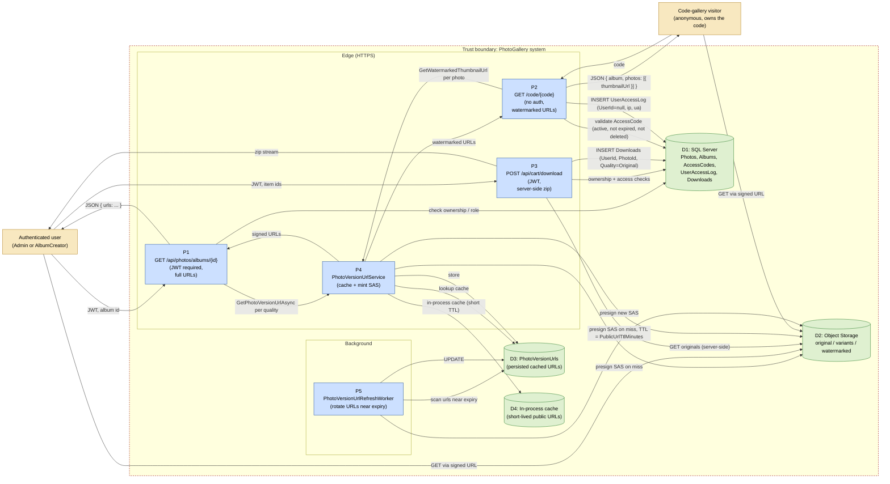

# 08 — Photo Download Data Flow Diagram

Level-1 data flow diagram for the photo download use cases. Covers both the authenticated path (album owner / admin downloads any quality) and the unauthenticated path (access-code visitor sees watermarked variants only).

This diagram pattern is owned by the security-reviewer agent. See `data-flow-diagram-security` skill.

## DFD

## Data elements

| Label | Element                                                       | Sensitivity                                                              |
| ----- | ------------------------------------------------------------- | ------------------------------------------------------------------------ |
| Owner | Authenticated user, role = Admin or AlbumCreator              | Identity in JWT. Owner check on album.                                   |
| Visitor | Anonymous, holds an `AccessCode` string                     | No identity. Auditability via IP + User-Agent in `UserAccessLog`.        |
| P1    | `PhotosController.GetAlbumPhotos`                             | Returns full-quality URLs to authorized users only.                      |
| P2    | `AccessCodeController.GetByCode`                              | Returns watermarked thumbnail URLs only.                                 |
| P3    | `CartController.Download` / `CartZipService`                  | Streams a zip of originals. Records each download.                       |
| P4    | `PhotoVersionUrlService.GetPhotoVersionUrlAsync`              | The seam between consumers and the storage provider.                     |
| P5    | `PhotoVersionUrlRefreshWorker`                                | Background; rotates persisted URLs within `PreSignedUrlRefreshWindowDays`.|
| D1    | SQL Server                                                    | Workload Identity + Key Vault in Azure.                                  |
| D2    | Object Storage                                                | SAS-only access for clients. Server-side `DefaultAzureCredential` for the API and workers in Azure. |
| D3    | `PhotoVersionUrls` table                                      | Persisted long-lived URLs. Rotated by P5.                                |
| D4    | In-process LRU cache                                          | Short-lived URLs for public visitors. Per-replica.                       |

## Trust boundaries crossed

1. Owner / Visitor → P1/P2/P3 (TLS, JWT or unauthenticated).
2. P4 → D2 (mint SAS, requires API credential).
3. Owner / Visitor → D2 (direct GET via SAS, no API involvement).
4. P3 → D2 (server-side GET for cart, requires API credential).

## Authorization model

| Endpoint                              | Auth                                        | Visibility                                                            |
| ------------------------------------- | ------------------------------------------- | --------------------------------------------------------------------- |
| `GET /api/photos/albums/{id}`         | JWT, `Album.OwnerId == user.Id OR Admin`    | All five base qualities + original + watermarked.                     |
| `GET /code/{code}`                    | None                                        | Only watermarked thumbnails. Modal also has watermarked medium.       |
| `POST /api/cart/download`             | JWT, must own each cart item's source album or have an active access code | Original quality only, streamed as zip.                               |
| `POST /api/photos/admin/*`            | JWT, `Admin` role                           | Admin endpoints (reconcile, reap, purge, chaos). See `ADMIN_JOBS`.    |

## Threats and mitigations

| Threat                                                  | Mitigation                                                                                |
| ------------------------------------------------------- | ----------------------------------------------------------------------------------------- |
| Code-gallery visitor sees the full-quality original     | P2 never returns URLs for non-watermarked variants. Authorization enforced at the URL-minting step. |
| Captured SAS URL replayed indefinitely                  | Bounded TTL on every URL. Visitor URLs in particular are short (default 60 min).          |
| Visitor accesses other albums' photos by guessing code  | `AccessCodes.Code` is high-entropy random. Expired + deleted codes return 404/410.        |
| Cart download bypasses access checks                    | P3 re-validates ownership / access for every item before adding to the zip.               |
| Visitor identity spoofed                                | Visitors are intentionally anonymous. The IP + UA in `UserAccessLog` is best-effort audit, not authoritative identity. |
| Watermark stripped from downloaded thumbnail            | Watermarking happens server-side in `ImageProcessingService`. The watermarked variant is a separate blob; the original is not exposed.|
| Pre-signed URL leak                                     | TTL bounded. URL cache TTL ≤ SAS TTL minus 3 min safety margin.                            |

## When to update

* New visibility tier (e.g. preview-quality URL for a third audience).
* New caching layer between P4 and D2.
* Change to the access-code authorization model (expiration, scope).
* New download endpoint or new cart shape.
